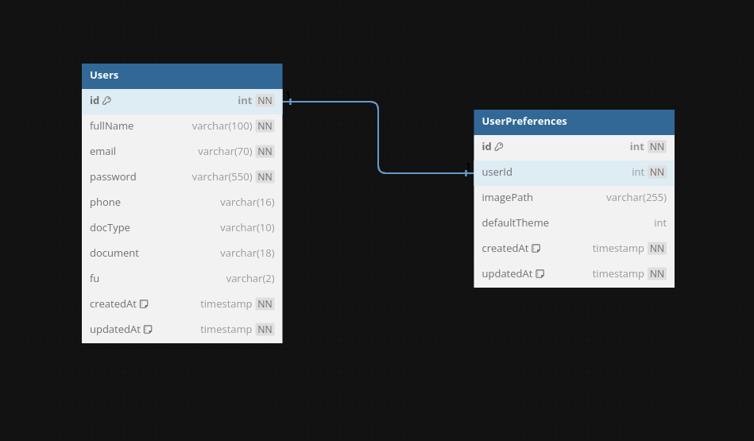
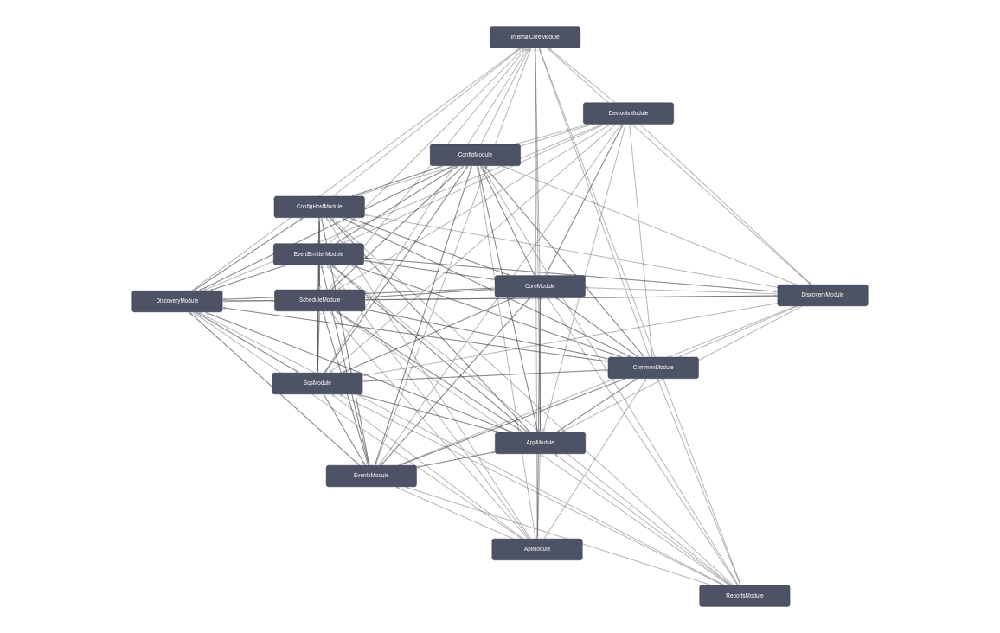
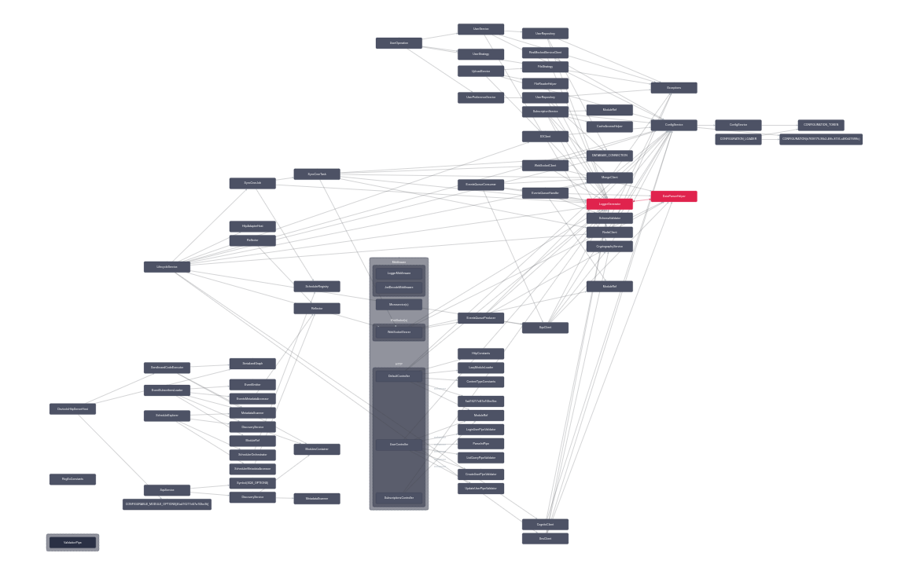

# Node Back-End Boilerplate :fire:

## Description

Node.js Domain-Driven Design Boilerplate with TypeScript for Back-End.

## Overview

#### What to do if the service goes down

- Check the logs;
- Test the dependencies and execution locally;
- Run automated tests;
- If necessary, merge with a hotfix on git;
- Rebuild the project and restart the service;

## Architecture

[Back-End Architecture](google.com)  

<div align='center'>
<br>
<a href='https://dbdiagram.io/d/6338e5857b3d2034ff03a8c4'>

<br>
DataBase Diagram
</a>
</div>

<div align='center'>
<br>
<b>Nest Modules Graph and Classes</b>
</div>

  
  

## Main technologies

- JavaScript: Web programming laguage;
- TypeScript: JavaScript superset for typing;
- Node.js: JavaScript runtime;
- Nest.js: TypeScript Framework for Back-End;
- Express: Robust tooling for HTTP servers;
- Socket.io: WebSocket library;
- AWS-SDK: A Node.js SDK to access AWS resources, such as:
  * SQS: Queue management service;
  * SNS: Topic notification service;
  * S3: Files storage service;
  * Cognito: Users authenticator service;
- Sequelize: ORM for relational databases;
- PostgreSQL: Relational (SQL) database;
- MongoDB: Schematic and document-oriented NoSQL database;
- Redis: Cache and in-memory key-value NoSQL database;
- Docker: Services isolation and process resources management with containers;
- SonarQube: Test coverage and code quality analyzer;
- Winston: Custom logger with transports;
- Joi: Schema validator library;
- EsLint: JavaScript/TypeScript linter;
- Prettier: JavaScript/TypeScript formatter;
- Jest: Testing Framework;
- Huksy: Git hook-listenner used to check tests, format the code and the commits;

---

### Install dependencies

1. Install project dependencies  
```shell
yarn install
```

2. Install AWS CLI  
[AWS CLI](https://docs.aws.amazon.com/cli/latest/userguide/getting-started-install.html)

3. Configure AWS CLI
```shell
$ aws configure
> AWS Access Key ID [****]: mock
> AWS Secret Access Key [****]: mock
> Default region name [us-east-1]: us-east-1
> Default output format [table]: json
```

### Execution Steps

1. Start Docker containers;
1. Mock external services;
1. Creat database entities and populat registers;
1. Start HTTP REST API;
1. Start TCP WebSocket;
1. Send message to Queue;
1. Receive message from Queue;

## Environment Preparation

1. Copy dotenv file  
```shell
cp env/.env.development.local ./.env # copy development local example
source ./.env # load envs on shell session
```

2. Initialize the composefile (`docker-compose.yml`) available on project root folder.

```shell
docker-compose up -d # create and run all docker containers in background
```

## Running Locally

```shell
yarn run mock-dependencies # create messages queue and started external services mock
yarn run migrate && yarn run seed # create database entities and populate database registers
yarn run start:dev # start application in development mode
yarn run receive-messages # create websocket client and start connection to receive events
yarn run send-message # send event message to queue
```

## Interface

- [localhost:3000](`http://localhost:3000/`) - Application Interface (API)  
  * `/` - WebSocket Root Endpoint
  * `/api` - REST Root Endpoint
  	- `/api/docs` - Swagger API Documentation (Page)
  	- `/api/docs.json` - Swagger API Documentation (JSON)
  	- `/api/docs.yml` - Swagger API Documentation (YAML)
  * `/graphql` - GraphQL Endpoint
- [localhost:4000](`http://localhost:4000/`) - Mocked Service Page  
- [localhost:8000](`http://localhost:8000/`) - Nest.js DevTools Page  
- [localhost:8080](`http://localhost:8080/`) - Adminer Page  
- [localhost:8081](`http://localhost:8081/`) - Mongo Express Page  
- [localhost:8082](`http://localhost:8082/`) - Redis Commander Page  
- [localhost:8083](`http://localhost:8083/`) - Jenkins Page  
- [localhost:9000](`http://localhost:9000/`) - SonarQube Page  

___

### TO DO

- **Clustering**
	- [x] Clusters
		- [x] Kubernetes
			- [ ] Load Balancing
- **CI/CD**
	- [ ] Jenkins
	- [x] GitHub Actions
- **Monitoring**
	- [ ] Log Streams
		- [ ] Rancher
	- [ ] Grafana
- **Deployment**
	- [ ] Heroku
- **Nest.js**
	- [Hybrid Application](https://docs.nestjs.com/faq/hybrid-application)
	- [kafka](https://docs.nestjs.com/microservices/kafka)
- **Integrations**
	- [ ] Webhooks
	- [ ] OAuth
	- [Kafka](#to-do)
- **Tests**
	* _Integration_
		- [ ] Configs
		- Modules
			- Core
				- Infra
					- [ ] Cron Tasks
					- [ ] Logging
			- API
				- [ ] Guards
				- [ ] Pipes
				- [ ] Schemas
			- Events
				- [ ] Queue Handler
					- [ ] Handlers Schemas
				- [ ] Websocket Guards
				- [ ] Websocket Server
				- [ ] Websocket Client
	* _End-to-End_
		- Modules
			- Core
				- Infra
					- [ ] Database
					- [ ] Data
					- [ ] Cache
					- Integration
						- [ ] AWS
						- [ ] REST
					- [ ] Cron Jobs
					- [ ] Start
			- API
				- [x] Controllers
			- App
				- [ ] Repositories
			- Events
				- [ ] Queue Consumer
				- [ ] Queue Producer
				- [ ] Websocket Gateway
			- Reports
				- [ ] Services
- [ ] Manual SQL
	- [ ] Index
	- [ ] Transactions
