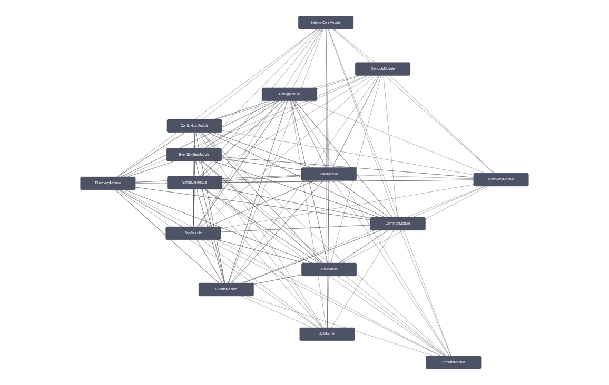
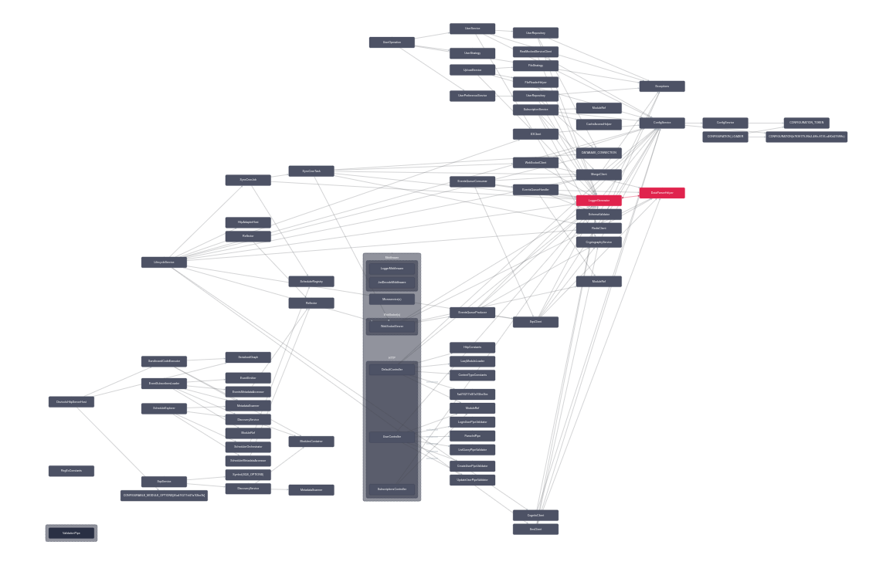

# Node Back-End Boilerplate :fire:

## Description

Node.js Boilerplate for Back-End using TypeScript and Nest.js.

## Overview

### Architecture

[Back-End Architecture](https://google.com)  

<div align='center'>
	<br>
	<a href='https://dbdiagram.io/d/6338e5857b3d2034ff03a8c4'>
	
	<br>
	DataBase Diagram
	</a>
</div>

<div align='center'>
	<br>
	<b>Nest Modules Graph and Classes</b>
</div>

  
  

---

### Main technologies

- **JavaScript**: Web programming language;
- **TypeScript**: JavaScript superset for typing;
- **Node.js**: JavaScript runtime;
- **Nest.js**: TypeScript Framework for Back-End;
- **Express**: Robust tooling for HTTP servers;
- **Socket.io**: WebSocket library;
- **AWS-SDK**: A Node.js SDK to access AWS resources, such as:  
	> _SQS_: Queue management service;  
	> _SNS_: Topic notification service;  
	> _S3_: Files storage service;  
	> _Cognito_: Users authenticator service;  
- **TypeORM**: ORM for databases;
- **PostgreSQL**: Relational (SQL) database;
- **MongoDB**: Schematic and document-oriented NoSQL database;
- **Redis**: Cache and in-memory key-value NoSQL database;
- **Winston**: Custom logger with transports;
- **Joi**: Schema validator library;
- **Jest**: Testing Framework;
- **Docker**: Services isolation and process resources management with containers;
- **Kubernetes**: Containers orchestration system;
- **Grafana**: Containers data visualization and dashboards;
- **Sentry**: Errors capture, tracing and metrics;
- **SonarQube**: Test coverage and code quality analyzer;
- **ESLint**: JavaScript/TypeScript linter and formatter;
- **Lefthook**: Git hooks tool used to check tests, format the code and the commits;

### Services

- [localhost:3000](http://localhost:3000/) - Application Interface (API)  
	* `/` - WebSocket Root Endpoint  
	* `/api` - REST Root Endpoint  
		- `/api/docs` - Swagger API Documentation (Page)  
		- `/api/docs.yml` - Swagger API Documentation (YAML)  
		- `/api/docs.json` - Swagger API Documentation (JSON)  
	* `/graphql` - GraphQL Endpoint  
- [localhost:4000](http://localhost:4000/) - Mocked Service Page  
- [localhost:8000](http://localhost:8000/) - Nest.js DevTools Page  
- [localhost:8080](http://localhost:8080/) - Adminer Page  
- [localhost:8081](http://localhost:8081/) - Mongo Express Page  
- [localhost:8082](http://localhost:8082/) - Redis Commander Page  
- [localhost:9000](http://localhost:9000/) - Jenkins Page  
- [localhost:9001](http://localhost:9001/) - SonarQube Page  
- [localhost:9002](http://localhost:9002/) - Grafana Page  
- [localhost:9003](http://localhost:9003/) - BackStage Page  

## Running Locally

1. Install project dependencies  
```shell
npm install
```

2. Install [AWS CLI](https://docs.aws.amazon.com/cli/latest/userguide/getting-started-install.html)

3. Configure AWS CLI
```shell
$ aws configure
> AWS Access Key ID [****]: mock
> AWS Secret Access Key [****]: mock
> Default region name [us-east-1]: us-east-1
> Default output format [table]: json
```

4. Run scripts
```shell
npm run db:migration-run && npm run db:seed # create database entities and populate database registers
npm run mock-dependencies # create message queue and storager and start external services mock
npm run start:dev # start application in development mode
npm run receive-messages # create websocket client and start connection to receive events
npm run send-message # send event message to queue
```

### Execution Steps

1. Start Docker containers or Kubernetes cluster;
1. Mock external services;
1. Create database entities and populate registers;
1. Start HTTP REST API & GraphQL API;
1. Start TCP WebSockets Server;
1. Send message to Queue;
1. Receive message from Queue;

#### What to do if the service goes down

- Check the logs;
- Test the dependencies and execution locally;
- Run automated tests;
- If necessary, merge with a hotfix on git;
- Rebuild the project and restart the service;

## Environment Preparation

1. Copy dotenv file  
```shell
cp envs/.env.local ./.env # copy development local example
source ./.env # load envs on shell session
```

2. Initialize the composefile (`docker-compose.yml`) available on project root folder.

```shell
# create and run essentials docker containers in background
docker-compose up -d cloud database data cache
# or
# create and run all docker containers in background
docker-compose up -d
# and
# delete all containers and volumes
docker-compose down -v

# build locally application docker image
docker build -t boilerplate-image:1.0 . # replace './Dockerfile' to 'infra/docker/Dockerfile.prod'
docker run --name boilerplate-container -d --env TZ=America/Sao_Paulo --memory=2g --cpus=1 boilerplate-image:1.0
```

3. Prepare Kubernetes cluster locally (optional).

```shell
# create Kind cluster (only for tests/development)
kind create cluster --config=infra/kubernetes/cluster/boilerplate-cluster-kind.yml
# load application docker image on Kind (only for tests/development)
kind load docker-image -n boilerplate-cluster boilerplate-image:1.0

# create namespace
kubectl create -f=infra/kubernetes/namespaces/boilerplate-namespace.yml

# secrets
kubectl create -f=infra/kubernetes/secrets/boilerplate-secrets.yml
# or
# create secrets from env (only for tests/development)
kubectl create secret generic -n boilerplate-namespace boilerplate-secrets --from-env-file=envs/.env.production

# deployments
kubectl create -f=infra/kubernetes/deployments/boilerplate-deployment.yml

# services
kubectl create -f=infra/kubernetes/services/boilerplate-service.yml

# connect CONTAINER:HOST ports
kubectl port-forward -n boilerplate-namespace services/boilerplate-service 3000
# tail deployment logs
kubectl -n boilerplate-namespace logs --follow deployments/boilerplate-deployment # follow first pod
kubectl -n boilerplate-namespace logs --follow boilerplate-deployment-76c9b5bdcc-2t4wp # follow pod with ID 'boilerplate-deployment-76c9b5bdcc-2t4wp'

# delete locally application docker image
docker image rm boilerplate-image:1.0
# delete all cluster and resources (only for tests/development)
kind delete cluster --name boilerplate-cluster
# delete resource
kubectl delete -f=<resource_config_path> # or kubectl delete -n <resource_namespace> <resource_type> <resource_name>
```

___

## TO DO

- **Clustering**
	- [x] Clusters
		- [x] Kubernetes
		- [ ] Load Balancing
- **CI/CD**
	- [ ] Jenkins
- **Deployment**
	- [x] Heroku
- **Tests**
	* _Integration_
		- [ ] Modules
			- [ ] API
				- [ ] Controllers
				- [ ] DTO
				- [ ] Pipes
				- [ ] Schemas
			- [ ] App
				- [ ] API
					- [ ] Controllers
					- [ ] DTO
					- [ ] Pipes
					- [ ] Schemas
				- [ ] Repositories
				- [ ] Services
			- [ ] Core
				- [ ] Configs
				- [ ] Cron
					- [ ] Tasks
				- [ ] Infra
					- [ ] Models
					- [ ] Repositories
					- [ ] Integration
						- [ ] Rest
				- [ ] Logging
				- [ ] Start
			- [ ] Domain
			- [ ] Events
				- [ ] Queue
					- [ ] Handlers
						- [ ] Schemas
				- [ ] Websocket
			- [ ] Graphql
				- [ ] DTO
				- [ ] Services
	* _End-to-End_
		- [ ] Modules
			- [ ] API
				- [ ] Controllers
				- [ ] Filters
				- [ ] Guards
				- [ ] Middlewares
			- [ ] App
				- [ ] API
					- [ ] controllers
			- [ ] Core
				- [ ] Cron
					- [ ] Jobs
				- [ ] Infra
					- [ ] Cache
					- [ ] Data
					- [ ] Database
						- [ ] Models
						- [ ] Repositories
					- [ ] Integration
						- [ ] AWS
					- [ ] Providers
			- [ ] Domain
			- [ ] Events
				- [ ] Queue
					- [ ] Consumers
					- [ ] Producers
				- [ ] Websocket
					- [ ] Client
					- [ ] Guards
					- [ ] Server
			- [ ] Graphql
				- [ ] DTO
				- [ ] Resolvers
