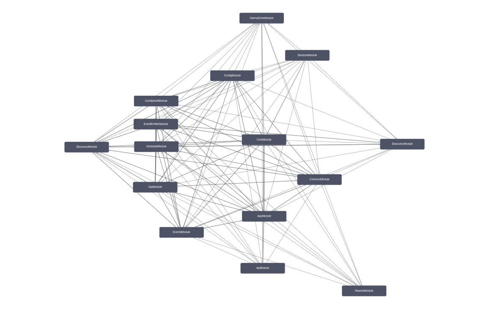
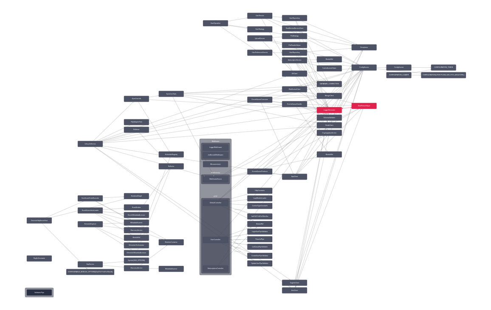

# Architecture

[Back-End Architecture](https://google.com)  

---

  

	<a href='https://dbdiagram.io/d/6338e5857b3d2034ff03a8c4'>
		DataBase Diagram
	</a>

	 
	<b>Nest Modules Graph and Classes</b>

  
  
